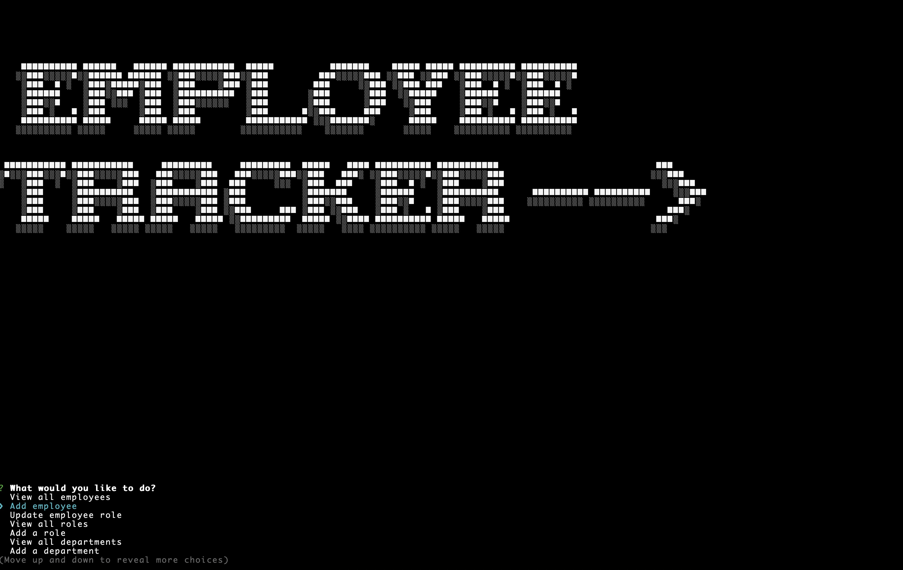

 

  # Title: Employee Tracker

    
  
  ## Description: Employee Tracker is a management system that uses a MYSQL database to record view and edit employee's Roles, and departments. In these categories there is data such as name ID and salary. The program is CLI driven, and uses nodejs with MYSQL2 and Inquirer packages. It also uses the table package and figlet npn package. The program will ask questions in a menu driven system and will update create or display accordingly. The output will also be formated using the table NPM package.

  ## Usage:  The user runs node index.js, the program begins with a really cool banner. The user then is given a selection of choices. When the user selects any of the view options, such as view employees, they will see all employees formated with the table command. The user is then taken back to the main menu. IF the user selects a edit or update command like add role, they will be asked a series of questions, that are required inputs for the table. The user will then be taken back to the main menu. When the user selects exit the user will then exit the program.

  ## Questions: johndesgarennes@gmail.com

  ## Github username: jdesgarennes

  ## License type: GPL

  